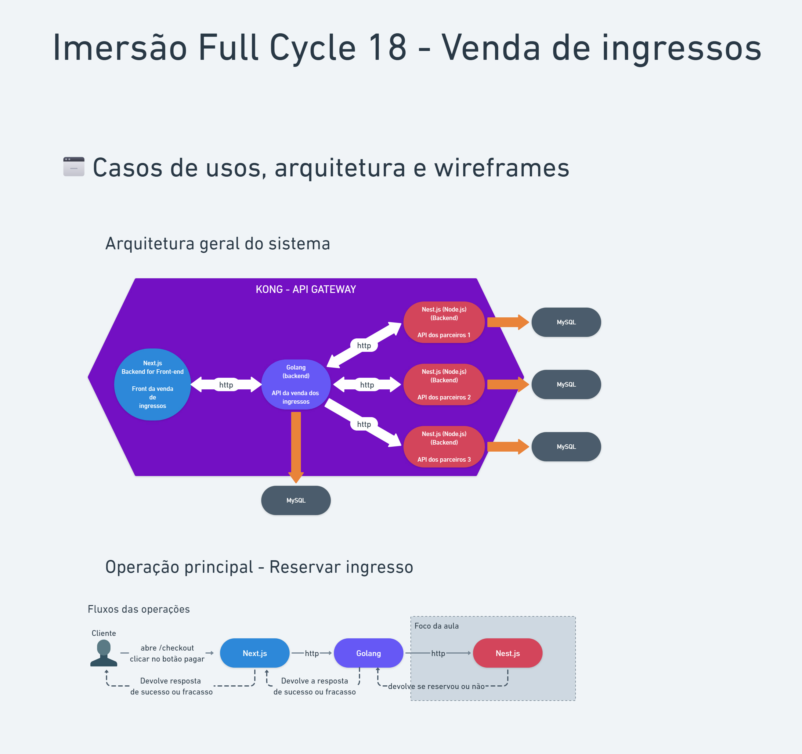

# Ticket Reservation System - immersion Full Stack && Full Cycle 18

## Project organization and architecture
- **Partners API: NestJS REST applications to manage reservation on each partner
- **Sales API: Go REST application connected to Partners API to manage requests from Web Interface
- **Web Interface: Next.js web application connected to Sales API
- **API-Gateway: Kong application to manage API hosts/routes/headers/etc

